# Lab_3_MobileSecurity — Observation du trafic HTTP(S) avec Burp Suite

## Objectif

Observer le trafic réseau d’un émulateur Android à l’aide de Burp Suite dans un environnement de laboratoire.

---

## Configuration

* Burp Suite en cours d’exécution
* Proxy listener actif sur `*:8080`
* IP hôte : `192.168.11.101`
* Port proxy : `8080`

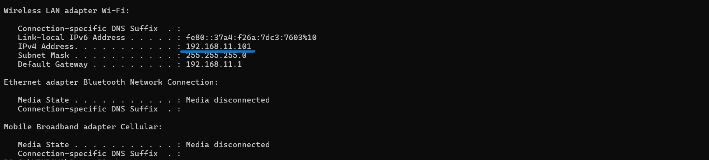

---

## Étapes

### 1. Démarrage de Burp

Vérifier que le proxy listener est actif.

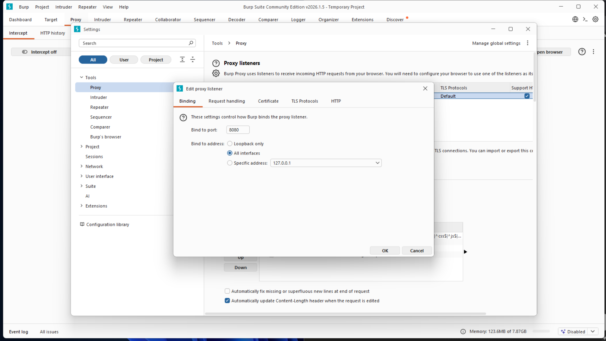
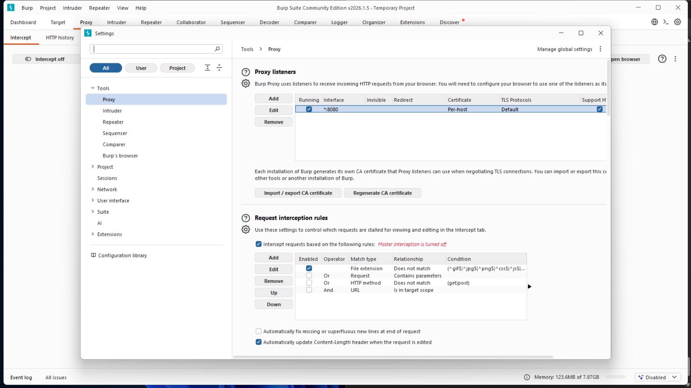

---

### 2. Configuration du proxy Android

Dans l’émulateur :

* Wi-Fi → AndroidWifi
* Proxy → Manual
* Host → `192.168.11.101`
* Port → `8080`

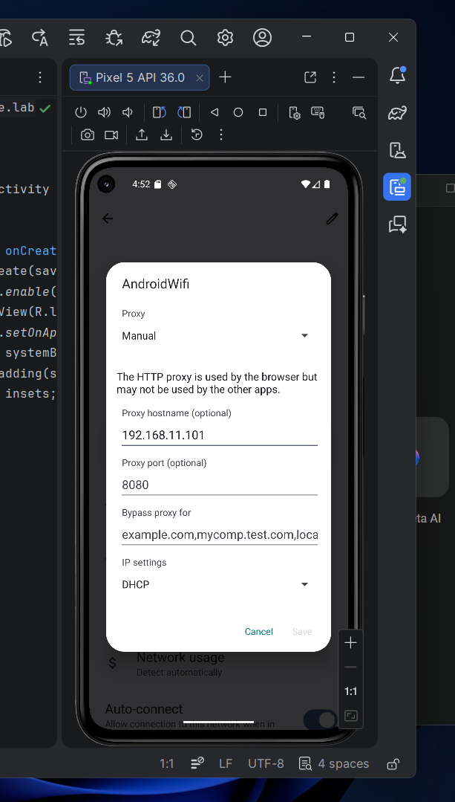

---

### 3. Vérification HTTP

Dans le navigateur de l’émulateur, ouvrir :

`http://neverssl.com`

Vérifier que des requêtes apparaissent dans **HTTP history**.

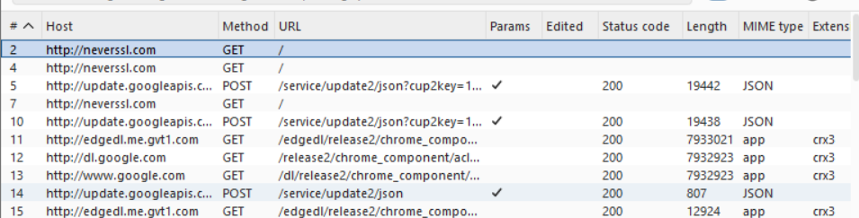
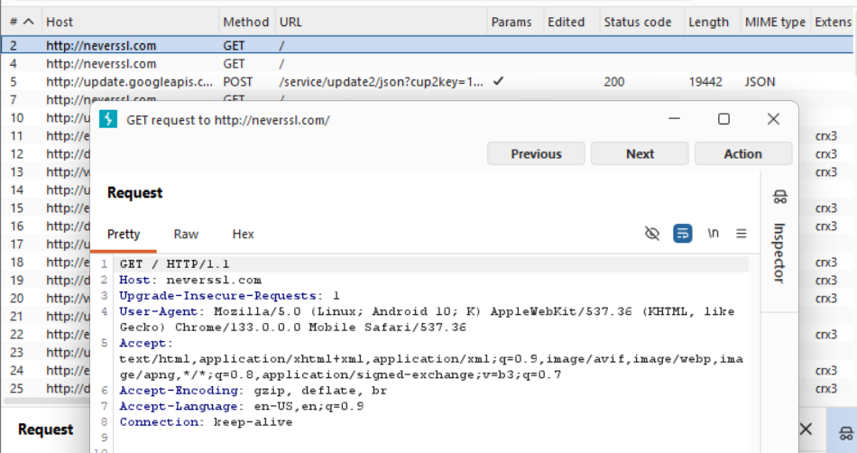
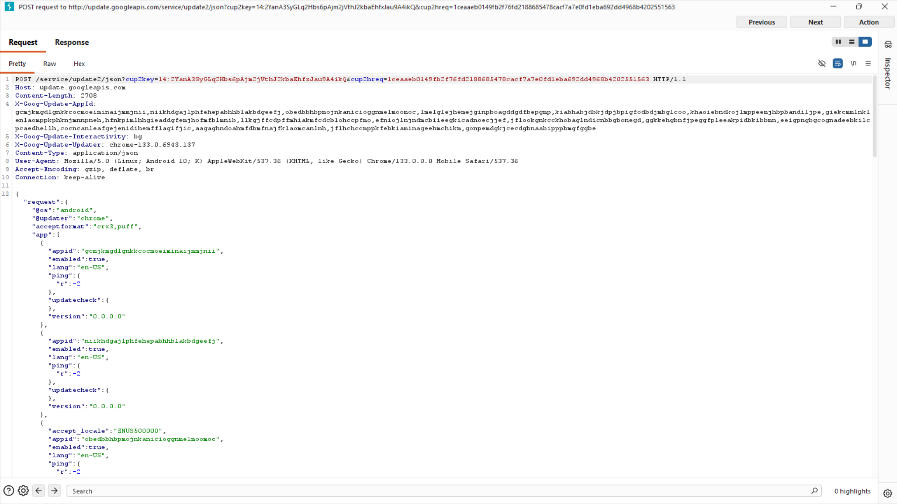

---

### 4. Test Intercept

* Activer **Intercept is on**
  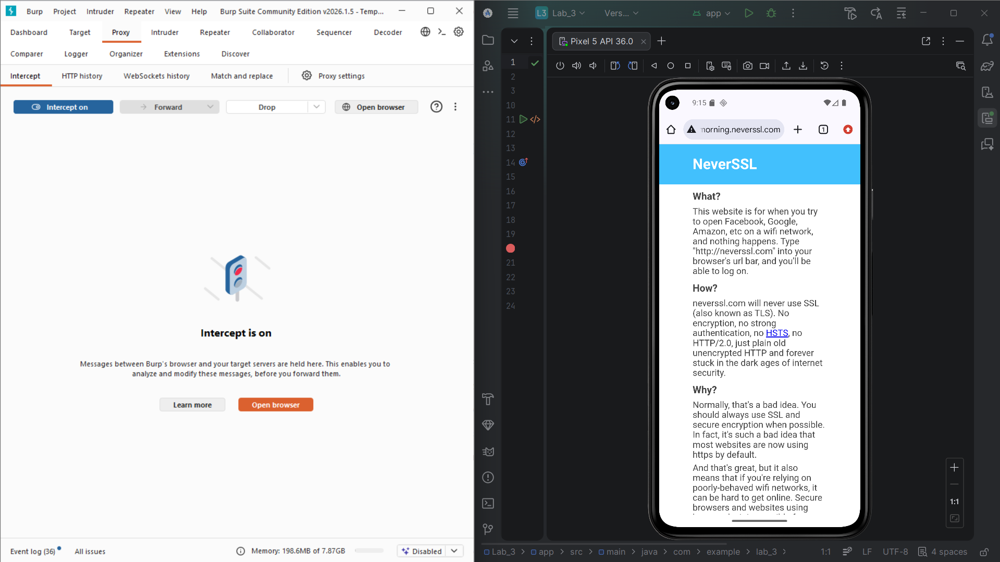

* Rafraîchir la page

* Observer la requête
  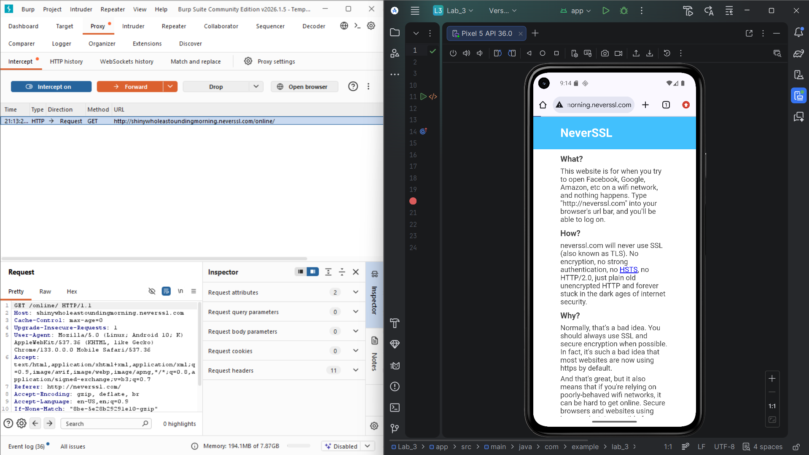

* Cliquer **Forward**

* Remettre **Intercept is off**

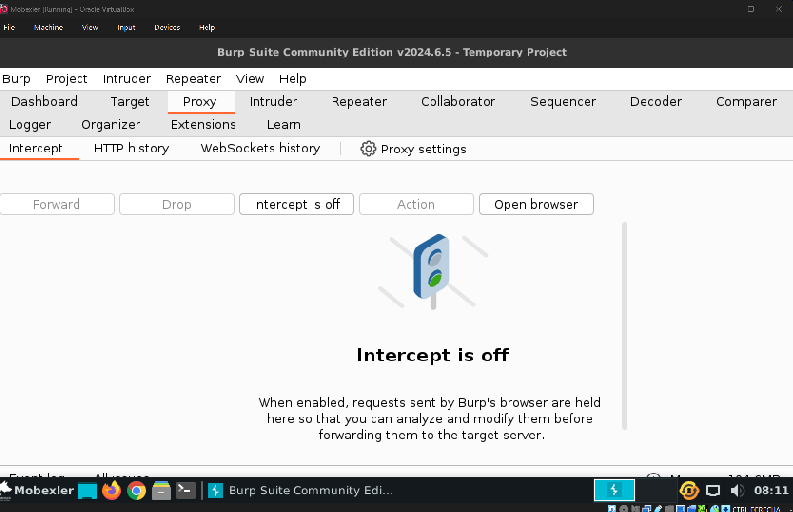

---

### 5. Principe HTTPS

Observer l’écran **Install a certificate** dans l’émulateur et identifier le rôle du certificat CA pour l’analyse HTTPS en laboratoire.

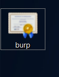
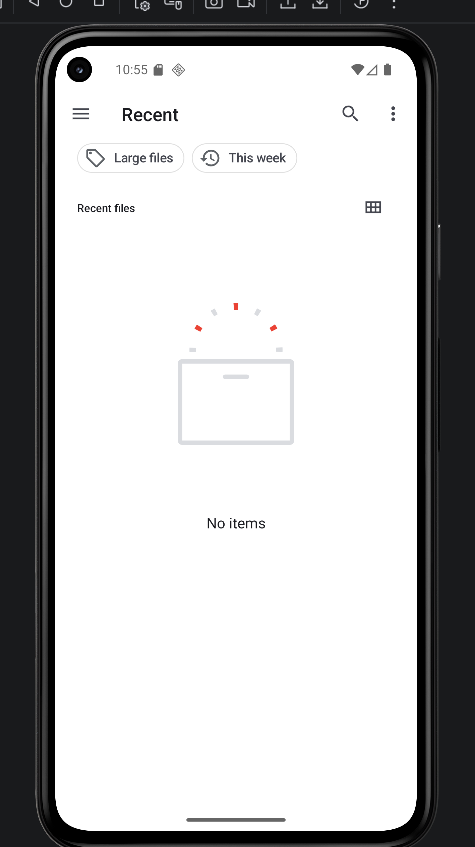
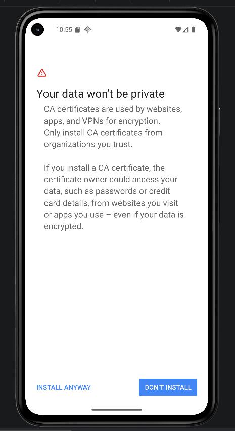
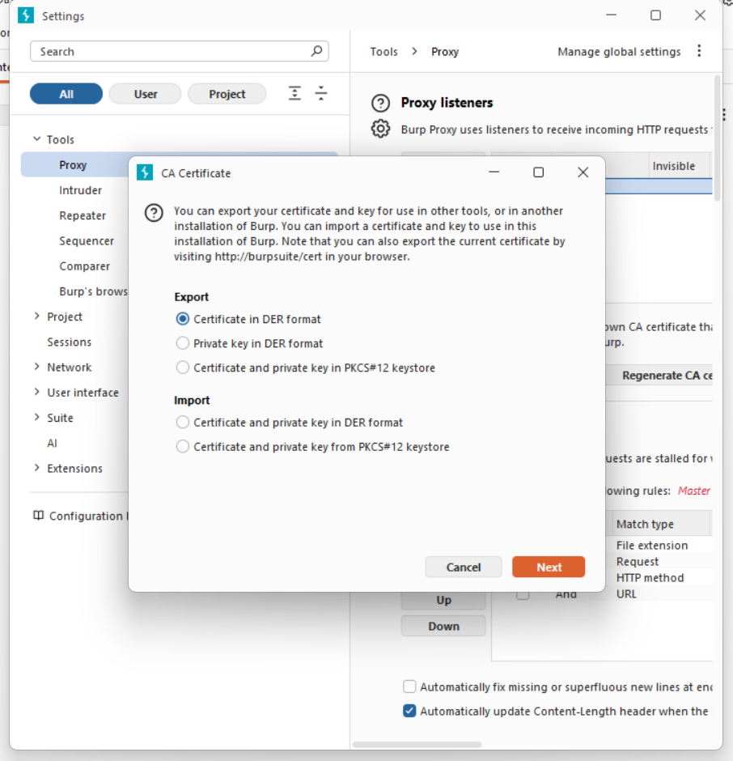
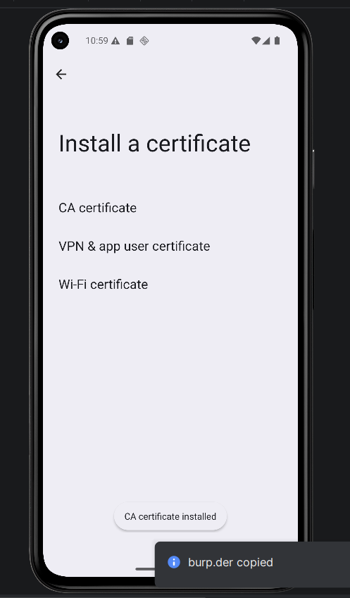

---

## Nettoyage

* Remettre le proxy Android sur **None**
  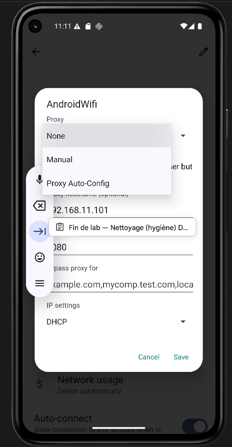

* Supprimer le certificat de laboratoire si installé
  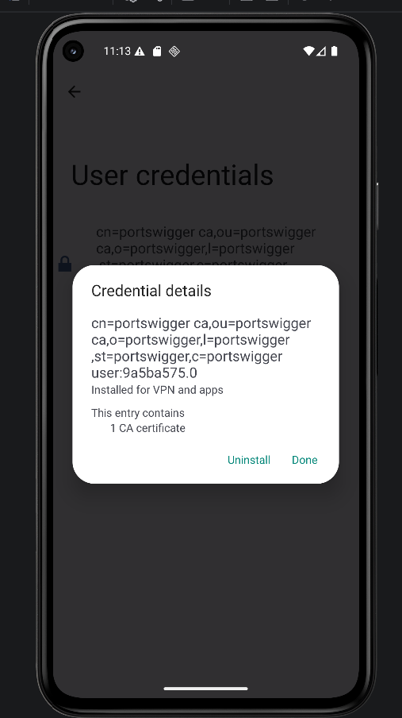
  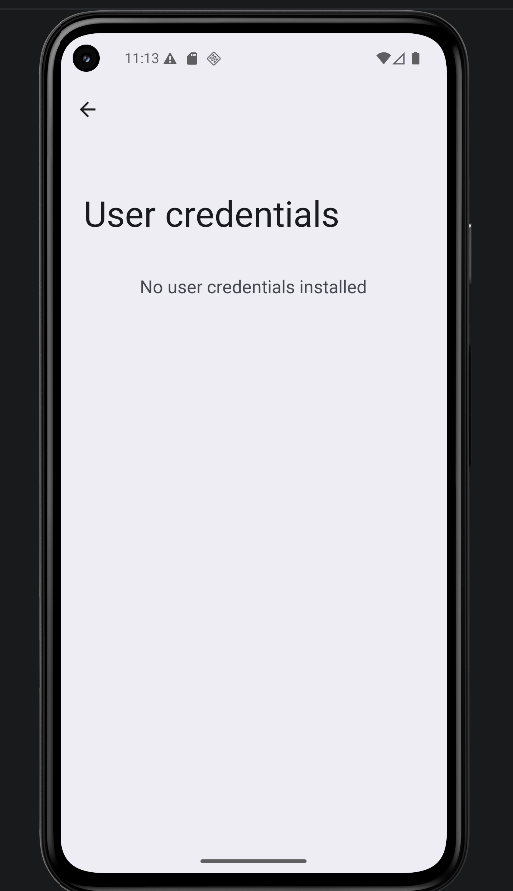

* Fermer Burp Suite
  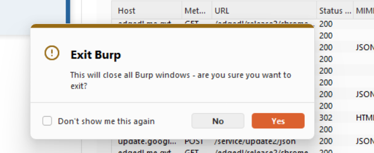

---

## Conclusion

Le test confirme que le proxy permet d’observer le trafic de l’émulateur dans un contexte contrôlé.
